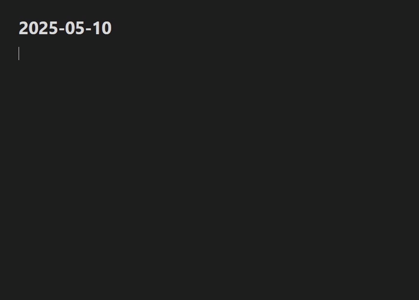
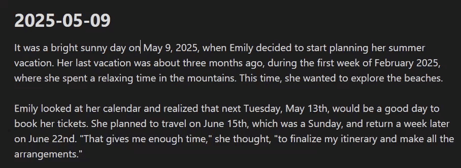
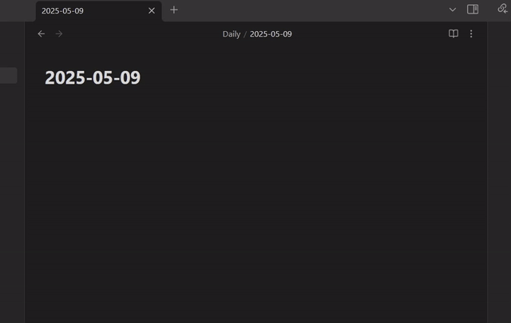

# Quick Dates

This is a plugin for Obsidian that is designed to reduce as much friction as possible between you and daily notes (whether linking or opening), or just date formatting in general.

Quick Dates is intended to be a replacement and enhancement of the (seemingly abandoned, but still great) plugin [Natural Language Dates](https://github.com/argenos/nldates-obsidian) by argenos, offering the same functionality plus more.

This plugin is extremely customizable and flexible. Read the settings descriptions and play around with it until you find something that suits you.

## Highlights

⭐ Powerful, responsive, and informative inline suggester that supports multiple insertion modes (link, plain text, alternate formats, timestamps, etc.) using modifier keys, and even open the selected daily note from here.

Type `qd` (customizable in settings) to get started:

⭐ Intelligent conversion of plain text to daily note links (or any other format you desire):

⭐ Scan and convert entire notes with different date formats, relative time phrases, etc.

⭐ Jump to specific daily notes quickly using the `Open daily note` command:

## Contributing and Issues

I am open to pull requests and feature requests if they make sense for the goals of the plugin, and of course, please report bugs!

If a setting or feature doesn't make sense, its description is confusing, or just behaves unexpectedly, let me know in an issue and I will attempt to clarify either in the README or in the setting description itself.

## Credits

- Original [Natural Language Dates](https://github.com/argenos/nldates-obsidian) plugin by argenos.
- tbergeron's [fork of NLD](https://github.com/tbergeron/obsidian-nldates-redux) that inspired the contextual timestamps/notion-like behavior idea.
- charliecm's [open-with-nldates](https://github.com/charliecm/obsidian-open-with-nldates) plugin for nldates that inspired the 'open daily note using natural language' feature.

### Libraries Used

- [chrono](https://github.com/wanasit/chrono)
- [date-holidays](https://github.com/commenthol/date-holidays)
- [obsidian-daily-notes-interface](https://github.com/liamcain/obsidian-daily-notes-interface)
- [obsidian-dev-utils](https://github.com/mnaoumov/obsidian-dev-utils)